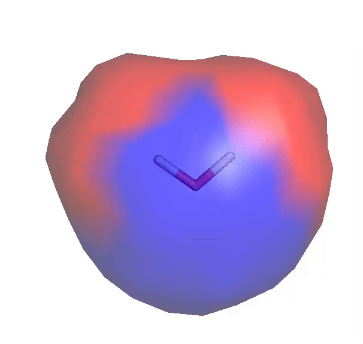

# EMSuite

<div class="emsuite-hero" markdown>

**Electrostatic maps that connect molecular environments to measurable
properties.**

EMSuite builds van der Waals surfaces, maps electrostatic potentials, and
calculates how external charges perturb quantum-chemical observables.

</div>

[](https://www.python.org/)
[](https://github.com/sajagbe/emsuite/blob/main/LICENSE)
[](https://github.com/sajagbe/emsuite)

## What EMSuite does

- **Surface generation** — build reproducible van der Waals sampling surfaces
  from XYZ geometries or SMILES.
- **Potential mapping** — evaluate APBS potential or Gauss-law surface charge,
  including protein/ligand occupancy workflows.
- **Electrostatic tuning** — measure how probe charges change orbital,
  energetic, response, and excited-state properties.
- **Coupled workflows** — use potential-derived heterogeneous charges directly
  as tuning perturbations.
- **Typed Python API** — configure channels with immutable input objects and
  consume structured result objects.

## Installation

=== "uv"

    ```bash
    uv add emsuite
    ```

=== "pip"

    ```bash
    pip install emsuite
    ```

GPU-accelerated PySCF support is available through the `gpu` extra on a
compatible CUDA system:

```bash
pip install "emsuite[gpu]"
```

## Four channels, one workflow

| Channel | Input | Main result | CLI |
| :--- | :--- | :--- | :--- |
| Surface | XYZ or SMILES | sampled `.surf` | `emsuite -s surface.in` |
| Potential | molecule/protein + surface | potential or charge `.surf` | `emsuite -p potential.in` |
| Tuning | molecule + charged surface | CSV, MOL2 maps, logs | `emsuite -t tuning.in` |
| Coupled | potential and tuning settings | potential + tuning results | `emsuite -c coupled.in` |

## Quick example

```python
from emsuite import SurfaceInput

surface = SurfaceInput.from_config(
    input_type="SMILES",
    input_data="O",
    output_surf="water.surf",
    optimize=True,
).run()

print(surface.path)
```

All channels accept `.in` files, mappings, or keyword overrides through their
typed input classes.

<figure class="emsuite-demo">
  
  <figcaption>A compact Water workflow rendered from EMSuite output.</figcaption>
</figure>

## Start here

- [Quick Start](quick-start.md) — run a small surface-to-tuning workflow.
- [Concepts](concepts.md) — understand the channel and data model.
- [Python Workflows](guides/python.md) — compose typed inputs and results.
- [Reference](reference/cli.md) — look up commands, fields, and output formats.
